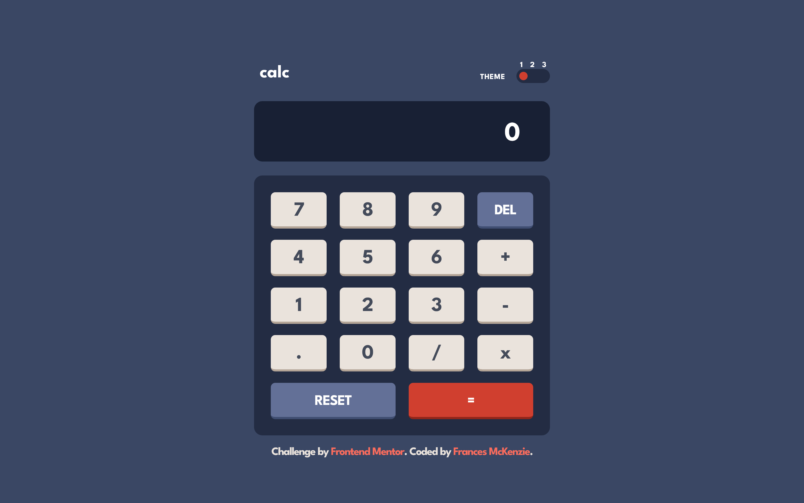

# Frontend Mentor - Calculator app solution

This is a solution to the [Calculator app challenge on Frontend Mentor](https://www.frontendmentor.io/challenges/calculator-app-9lteq5N29). Frontend Mentor challenges help you improve your coding skills by building realistic projects. 

## Check it out! :ghost:

The calculator is fully functional using your keyboard! 

| Key                | Calculator Function |
| ------------------ | ------------------- |
| Num keys           | Numbers             |
| .                  | Decimal             |
| +, -, *, /         | Operators           |
| =                  | Equals              |
| Backspace / Delete | Del                 |
| Escape             | Reset               |


## Table of contents

- [Overview](#overview)
  - [The challenge](#the-challenge)
  - [Screenshot](#screenshot)
  - [Links](#links)
- [My process](#my-process)
  - [Built with](#built-with)
  - [What I learned](#what-i-learned)
- [Author](#author)


## Overview

### The challenge

Users should be able to:

- See the size of the elements adjust based on their device's screen size
- Perform mathmatical operations like addition, subtraction, multiplication, and division
- Adjust the color theme based on their preference
- **Bonus**: Have their initial theme preference checked using `prefers-color-scheme` and have any additional changes saved in the browser

### Screenshot




### Links

- Solution URL: [github.com/frances-m/calculator-app](https://github.com/frances-m/calculator-app)
- Live Site URL: [francesm.dev/calculator-app](https://francesm.dev/calculator-app)

## My process

### Built with

- Semantic HTML5 markup
- SCSS
- Flexbox
- Mobile-first workflow
- jQuery

### What I learned

I was curious to see if I might be able to save the user's selected theme client-side and with a bit of searching I was able to find info on the `window.localStorgage` object. 

I started by creating a function, `app.setLocalTheme` that is called everytime the user update's the selected theme. The function checks to make sure the `localStorage` object exists, then adds the current theme's value to the variable `window.localStorage.theme`.

```js
app.setLocalTheme = () => {
  if (typeof window.localStorage !== "undefined") {
    window.localStorage.theme = app.$themesSlider.val();
  }
}
```

When the app initializes, it checks to see if a theme is set in the user's `localStorage` and if there is, it changes the value of the range `<input>` controlling theme selection to the theme stored there. Then the app calls a function to sets the user's theme.

```js
if (window.localStorage.theme !== "undefined") {
    app.$themesSlider.val(window.localStorage.theme);
}

app.setTheme();
```

## Author

- Website - [Frances McKenzie](https://francesm.dev)
- Frontend Mentor - [@frances-m](https://www.frontendmentor.io/profile/frances-m)
- LinkedIn - [Frances McKenzie](https://www.linkedin.com/in/frances-mckenzie-104035241/)

